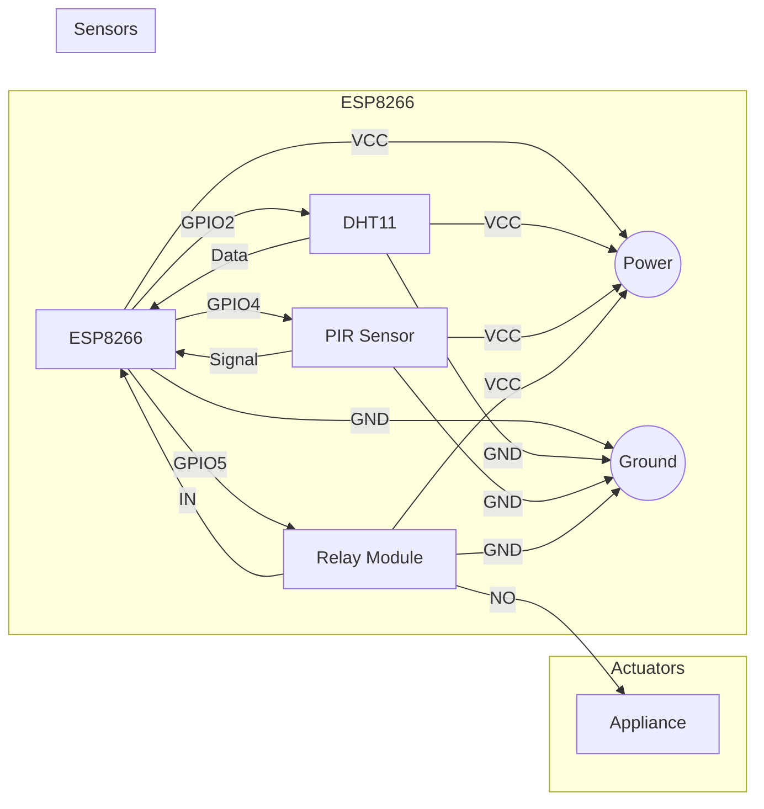

# ESP8266 Schematic Diagram

```mermaid
graph LR
    subgraph ESP8266
        A[ESP8266]
        A -- VCC --> B((Power))
        A -- GND --> C((Ground))
        A -- GPIO2 --> D[DHT11]
        A -- GPIO4 --> E[PIR Sensor]
        A -- GPIO5 --> F[Relay Module]
    end

    subgraph Sensors
        D[DHT11] -- VCC --> B((Power))
        D -- GND --> C((Ground))
        D -- Data --> A

        E[PIR Sensor] -- VCC --> B((Power))
        E -- GND --> C((Ground))
        E -- Signal --> A
    end

    subgraph Actuators
        F[Relay Module] -- VCC --> B((Power))
        F -- GND --> C((Ground))
        F -- IN --> A
        F -- NO --> G[Appliance]
    end
```